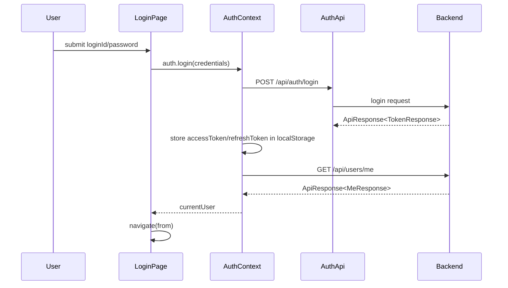
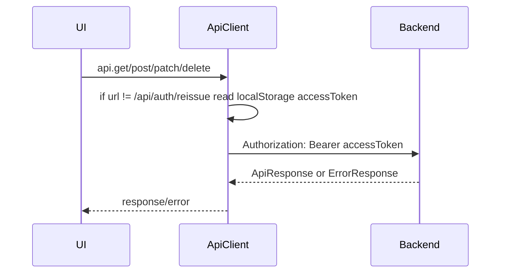
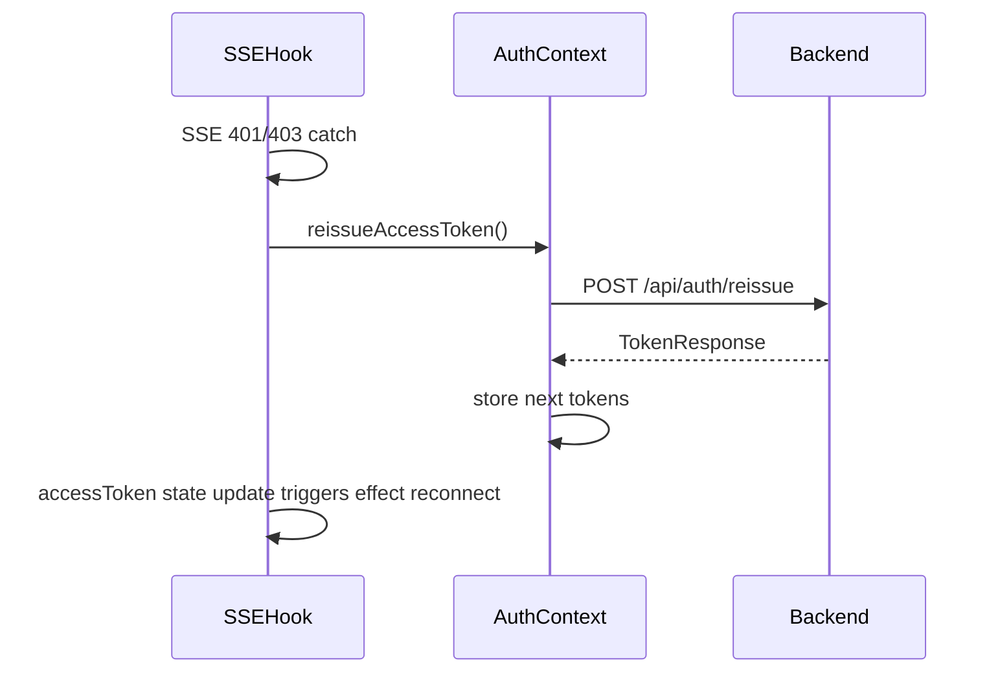
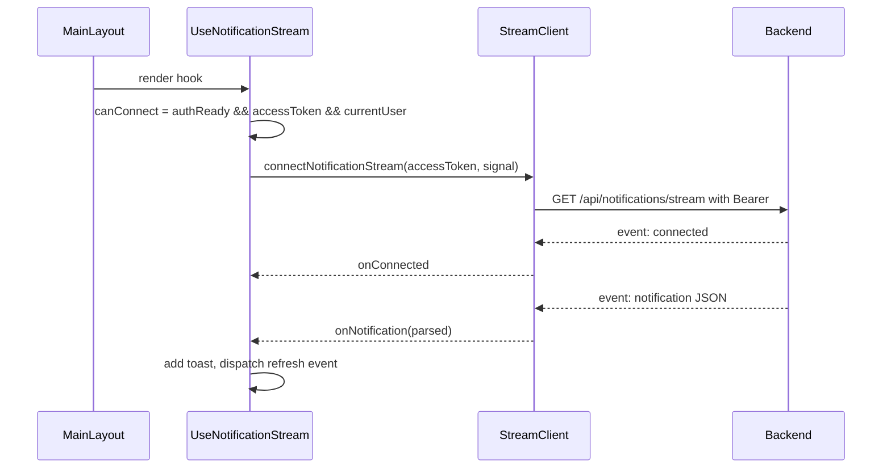

# Phase 10-1 Frontend Auth and SSE Flow

## 1. 인증 관련 주요 파일

- `src/auth/AuthContext.jsx`: access/refresh token 상태, localStorage 저장/삭제, login, logout, reissue, auth 복원.
- `src/auth/AuthContextValue.js`: storage key와 context 생성.
- `src/auth/useAuth.js`: context hook.
- `src/api/client.js`: axios base URL과 Authorization header 주입.
- `src/api/authApi.js`: signup/login/reissue/logout API 함수.
- `src/routes/ProtectedRoute.jsx`: 인증 필요 route guard.
- `src/routes/AdminRoute.jsx`: 관리자 route guard.
- Backend 계약: `AuthController`, `UserController`, `SecurityConfig`.

## 2. 로그인 흐름

- access token과 refresh token 모두 localStorage에 저장한다. 근거: `src/auth/AuthContext.jsx:66`, `src/auth/AuthContext.jsx:70`.
- 로그인 응답은 `data.data.accessToken`, `data.accessToken`, `data.result.accessToken` fallback을 허용한다. 백엔드 현재 정식 구조는 `ApiResponse<TokenResponse>`이다. 근거: `src/auth/AuthContext.jsx:10`, backend `ApiResponse.java:6`.
- 로그인 성공 후 `GET /api/users/me` 실패가 인증 실패가 아니면 fallback user를 만든다. 근거: `src/auth/AuthContext.jsx:149`.

## 3. API 요청 인증 흐름

- request interceptor가 `/api/auth/reissue`를 제외한 모든 axios 요청에 localStorage access token을 주입한다. 근거: `src/api/client.js:18`.
- 공통 response interceptor는 없다. 따라서 일반 API 401에 대한 자동 reissue/원요청 재시도는 구현되어 있지 않다.
- Admin notice API는 `createAuthConfig(accessToken)`으로 Authorization header를 명시적으로 전달한다. axios interceptor와 중복될 수 있으나 값은 동일한 token이어야 한다. 근거: `src/api/noticeApi.js:3`.

## 4. 401 및 재발급 흐름

- 일반 axios API 요청에서 401/403이 발생하면 각 화면의 error handling으로 처리된다. 공통 자동 재발급은 없다.
- 앱 초기화의 `GET /api/users/me`가 401/403이면 `clearAuth()`를 수행한다. 근거: `src/auth/AuthContext.jsx:111`.
- `reissueAccessToken()`은 저장된 refresh token으로 `POST /api/auth/reissue`를 호출하고, 성공 시 새 access/refresh token을 저장한다. 실패 시 `clearAuth()`를 수행한다. 근거: `src/auth/AuthContext.jsx:179`.
- reissue 동시성 제어 큐나 in-flight promise 공유는 없다. 현재 reissue를 직접 호출하는 주 경로는 SSE hook이다.

## 5. 로그아웃 흐름

- Header logout은 `auth.logout()` 후 `/`로 이동한다. 근거: `src/components/layout/Header.jsx:11`.
- `auth.logout()`은 backend logout API를 호출하지 않고 `clearAuth()`만 수행한다. 근거: `src/auth/AuthContext.jsx:175`.
- `authApi.logout()` 함수는 존재하지만 `Promise.reject(new Error('TODO...'))`로 구현되어 있고 확인된 호출이 없다. 근거: `src/api/authApi.js:19`.
- refresh token이 backend/Redis에 남는지는 backend 정책 확인 필요다. Frontend는 현재 refresh token invalidation API를 사용하지 않는다.

## 6. SSE 연결 흐름

- SSE client는 `fetchEventSource(`${API_BASE_URL}/api/notifications/stream`)`를 사용한다. 근거: `src/api/notificationStreamClient.js:23`.
- Authorization은 `Bearer ${accessToken}` header로 전달한다. 근거: `src/api/notificationStreamClient.js:24`.
- 연결 시작 조건은 `authReady && Boolean(accessToken) && Boolean(currentUser)`이다. 근거: `src/hooks/useNotificationStream.js:36`.
- `connected` event는 상태를 `connected`로 바꾸고, `notification` event만 JSON parse하여 toast와 refresh event에 반영한다. 근거: `src/api/notificationStreamClient.js:34`, `src/hooks/useNotificationStream.js:66`.
- heartbeat 전용 event 처리는 확인되지 않았다.

## 7. SSE 재연결 흐름

- `fetchEventSource` 내부 재시도 정책은 별도 설정하지 않았다. library 기본 정책에 의존한다.
- `onerror`에서 error를 다시 throw하므로 promise catch로 이어진다. 근거: `src/api/notificationStreamClient.js:53`.
- 인증 오류(401/403)이고 `MAX_AUTH_REISSUE_ATTEMPTS` 미만이면 `reissueAccessToken()`을 1회 시도한다. 근거: `src/hooks/useNotificationStream.js:11`, `src/hooks/useNotificationStream.js:119`.
- reissue 성공 후 직접 같은 controller로 재연결하지 않고, AuthContext의 accessToken state 변경으로 hook dependency가 바뀌어 기존 effect cleanup 후 새 effect가 연결되는 구조다.
- reissue 후 연결되면 `dispatchNotificationRefresh({ source: 'sse-reconnect' })`를 보낸다. 근거: `src/hooks/useNotificationStream.js:75`.

## 8. SSE 종료 흐름

- `canConnect`가 false가 되면 기존 `abortRef.current?.abort()` 후 status/toasts를 초기화한다. 근거: `src/hooks/useNotificationStream.js:38`.
- effect cleanup에서 `controller.abort()`를 호출한다. 근거: `src/hooks/useNotificationStream.js:151`.
- 로그아웃 시 `clearAuth()`로 accessToken/currentUser가 사라지고 `canConnect`가 false가 되어 abort된다.
- 사용자 변경 후 이전 SSE 연결은 새 effect 시작 전 `abortRef.current?.abort()`로 정리한다. 근거: `src/hooks/useNotificationStream.js:52`.

## 9. 확인된 위험

| Area | Finding | Evidence | Risk | Status |
|---|---|---|---|---|
| Token storage | access token과 refresh token 모두 localStorage 저장 | `src/auth/AuthContext.jsx:50`, `src/auth/AuthContext.jsx:54` | XSS 발생 시 refresh token까지 탈취 가능 | Phase 10 보안 정책 검토 |
| Logout | backend logout API가 존재하지만 frontend logout은 호출하지 않음 | frontend `src/api/authApi.js:19`, backend `AuthController.java:61` | refresh token 서버 측 폐기 누락 가능성 | P0/P1 결정 |
| Reissue | 일반 axios 401 자동 reissue/원요청 재시도 없음 | `src/api/client.js:32`까지만 error normalize | 만료 access token 상태에서 화면별 오류 노출 | P1 |
| Reissue concurrency | in-flight reissue 공유 없음 | `src/auth/AuthContext.jsx:179` | 여러 경로에서 reissue 도입 시 중복 재발급 위험 | P1 |
| SSE reconnect | library 기본 재시도에 의존 | `src/api/notificationStreamClient.js:23` | 운영 장애 시 retry 간격/상한 정책 불명확 | P1 |
| Heartbeat | heartbeat event 처리 없음 | `src/api/notificationStreamClient.js:34` | backend heartbeat 형식과 불일치 시 로그/상태 부정확 | 확인 필요 |
| URL join | SSE URL 문자열 결합 시 base URL trailing slash 정규화 없음 | `src/api/notificationStreamClient.js:23` | env 값이 `/`로 끝나면 `//api` 가능 | P1 |
| Admin guard | 프론트 admin 여부는 currentUser role 문자열에 의존 | `src/routes/AdminRoute.jsx` | backend role prefix와 프론트 role 값 매핑 확인 필요 | 확인 필요 |

## 10. Phase 10에서 유지해야 할 정책

- Entity 직접 노출 없이 backend DTO와 `ApiResponse<T>` 기준으로 화면 DTO를 해석한다.
- 인증이 필요한 mutation은 UI disable만 믿지 않고 backend 권한 검증을 최종 기준으로 둔다.
- SSE는 앱 전체에서 한 연결만 유지하는 현 구조를 우선 유지하되, StrictMode/로그아웃/사용자 전환 시 중복 연결 여부를 검증한다.
- Phase 10 UI 구현 중에도 `authApi.logout`, `closeTeam`, `deleteTeam` 같은 TODO API는 근거 없이 활성화하지 않는다.
- refresh token 저장/폐기 정책은 backend와 맞춰 결정하기 전까지 임의 변경하지 않는다.
